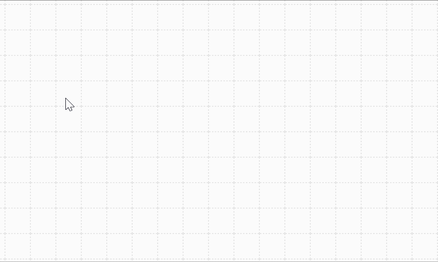

# Usage of Level Editor

## Get started

1. Select pen from `Pen Tool`
2. Draw tiles on the map
3. Click `Java Code` button to generate java code
4. Modify the level name
5. Copy, paste and save code as a java file to `external/level` folder
6. Run the game

## Features:

### Re-editing map
	1. Paste java code back to the input box in `Java Code` panel
	2. Switch back to `Map Design` panel

### Coalesce blocks
	Without: 

	With:

