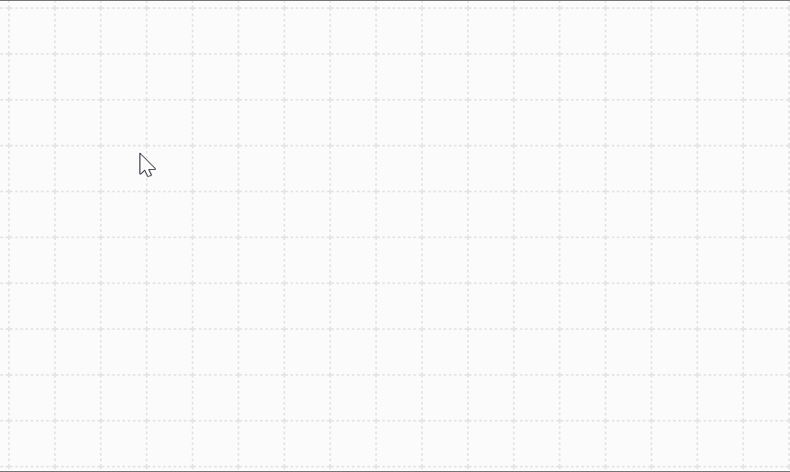

# Usage of Level Editor

## Get started

1. Select pen from `Pen Tool`
2. Draw tiles on the map
3. Click `Java Code` button to generate java code
4. Modify the level name
5. Copy, paste and save code as a java file to `external/level` folder
6. Run the game

## Features:

### Erasing
The `Earser` pen is on the top of `Pen Tool` selection, use it to draw on the block you want to earse.

### Clearing
The button `Clear Map` will clear all the tiles on the map and resize the map.

### Resizing
The button `Map Size` is for setting the map size, and its unit is tile.
Resizing map will clear the whole map.

### Re-editing map
1. Paste java code back to the input box in `Java Code` panel
2. Switch back to `Map Design` panel

### Coalescing blocks
Without: 

With:

